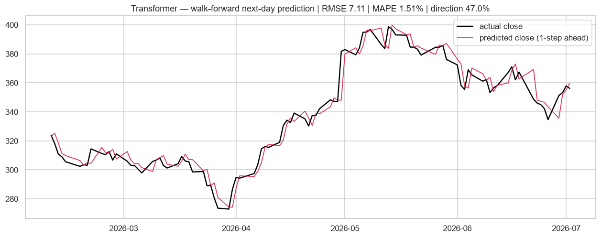
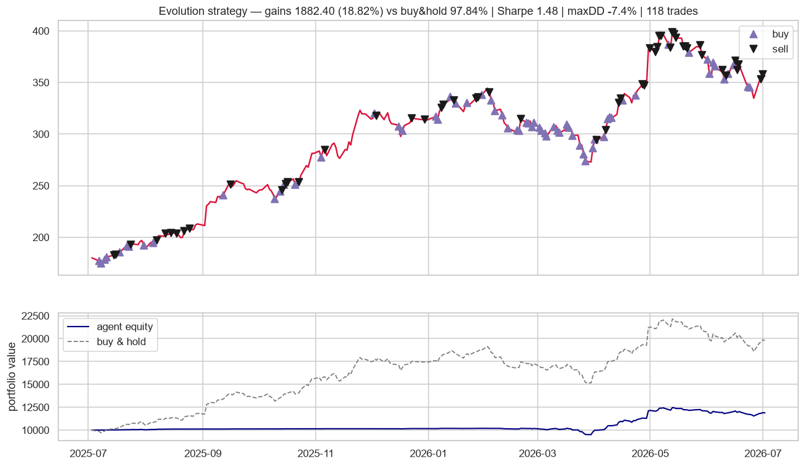
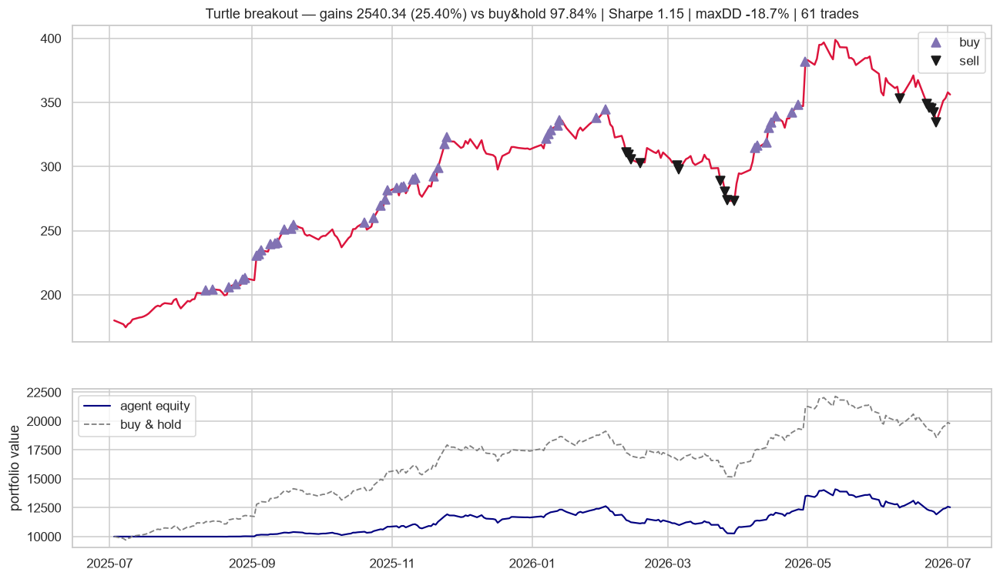

# MarketPulse 📈

**Modern stock forecasting, trading agents & market simulations** — a 2026 reimagining of the classic
[huseinzol05/Stock-Prediction-Models](https://github.com/huseinzol05/Stock-Prediction-Models)
(archived, TensorFlow 1.x), rebuilt from scratch on today's stack:

- **PyTorch** forecasters — LSTM, GRU, Transformer, **N-BEATS**, **PatchTST** — plus ARIMA, XGBoost and a drift baseline
- **Reinforcement-learning trading agents** — DQN & PPO via stable-baselines3 on a custom **Gymnasium** environment, plus an evolution-strategy agent and rule-based baselines
- **Monte Carlo simulations** — GBM, EWMA dynamic volatility, correlated multi-asset — and efficient-frontier portfolio optimization
- **Live data** via yfinance (locally cached), with bundled CSVs as offline fallback

What makes it different from the original (and from most "stock prediction" repos): **honest evaluation**.

- Forecasters predict **next-day log returns**, scored one-step-ahead **walk-forward** — no recursive
  error hiding, no smoothing tricks that inflate "accuracy" to 95%.
- Trading agents train on the **first 80%** of history and are backtested **out-of-sample on the last 20%**,
  with 10 bps transaction costs per side.
- Every result below is reproducible with one command.

---

## Quickstart

```bash
python -m venv .venv
.venv\Scripts\pip install -r requirements.txt   # Windows

# everything: forecasting zoo + agents + simulations (charts land in output/)
python scripts/run_all.py GOOG

# or individually
python scripts/run_forecasting.py TSLA
python scripts/run_agents.py GOOG
python scripts/run_simulations.py

# quick one-off forecast
python scripts/forecast.py TSLA patchtst 30
```

Smoke-run env vars: `EPOCHS`, `TEST_SIZE` (forecasting) · `ES_ITER`, `RL_STEPS` (agents).

---

## Results — forecasting (GOOG, 5y daily, last 100 days walk-forward)

| model | RMSE ($) | MAPE | direction acc. | train time |
|---|---|---|---|---|
| ARIMA | **7.03** | **1.46%** | 45.0% | 2s |
| LSTM | 7.03 | 1.47% | 45.0% | 13s |
| GRU | 7.08 | 1.50% | 37.0% | 31s |
| Drift (baseline) | 7.08 | 1.53% | **53.0%** | 0s |
| Transformer | 7.11 | 1.51% | 47.0% | 48s |
| PatchTST | 7.48 | 1.69% | 40.0% | 12s |
| XGBoost | 7.51 | 1.62% | 45.0% | 2s |
| N-BEATS | 7.76 | 1.71% | 41.0% | 10s |

**The honest takeaway** (and the reason this table looks nothing like the original repo's 95% claims):
on daily data, next-day returns are close to unpredictable — deep models struggle to beat a drift
baseline, and directional accuracy hovers around a coin flip. That *is* the expected result for an
efficient market; any repo telling you otherwise is leaking the future into its metrics.




30-day recursive forecasts (uncertainty compounds — labeled as scenarios, not predictions):


---

## Results — trading agents (GOOG, out-of-sample last 20% ≈ 1 year, 10 bps fees)

| agent | ROI | buy & hold | Sharpe | max drawdown | trades |
|---|---|---|---|---|---|
| PPO (RL) | **30.5%** | 97.8% | 1.30 | −20.2% | 126 |
| Turtle breakout | 25.4% | 97.8% | 1.15 | −18.7% | 61 |
| Evolution strategy | 18.8% | 97.8% | 1.48 | −7.4% | 118 |
| RSI mean-reversion | 3.8% | 97.8% | 1.21 | −2.7% | 29 |
| SMA crossover | 1.5% | 97.8% | **2.09** | −0.4% | 20 |
| DQN (RL) | 0.3% | 97.8% | 0.31 | −1.1% | 85 |

Agents trade **one unit per transaction** (the original repo's convention, kept so every agent is
comparable) — so ROI on a $10k account is structurally capped versus fully-invested buy & hold in a
bull market. Compare agents against *each other*, and look at Sharpe / drawdown for risk-adjusted
quality: the evolution-strategy agent made 19% while never drawing down more than 7.4%.





---

## Results — simulations

Monte Carlo, 252 trading days ahead (300 paths, p5/p50/p95 bands):


Efficient frontier over GOOG / TSLA / AMD / MSFT / AAPL (20k random portfolios + SLSQP optimum).
Current max-Sharpe weights: **GOOG 68% · AMD 26% · AAPL 6%**:


---

## Project structure

```
marketpulse/
  data.py                 yfinance loader + cache + technical features
  evaluation.py           walk-forward metrics & charts
  forecasting/
    base.py               Forecaster interface + walk-forward driver
    baselines.py          Drift, ARIMA
    xgb.py                XGBoost on engineered features
    torch_models.py       LSTM, GRU, Transformer (shared trainer, early stopping)
    nbeats.py             N-BEATS (Oreshkin et al. 2020)
    patchtst.py           PatchTST (Nie et al. 2023)
  agents/
    env.py                Gymnasium trading environment
    backtest.py           cost-aware backtester + signal/equity charts
    rules.py              turtle, SMA crossover, RSI
    evolution.py          evolution-strategy agent
    rl.py                 DQN / PPO (stable-baselines3)
  simulation/
    monte_carlo.py        GBM, EWMA dynamic vol, correlated multi-asset
    portfolio.py          efficient frontier (random search + SLSQP)
scripts/
  run_all.py · run_forecasting.py · run_agents.py · run_simulations.py · forecast.py
```

## Credits & disclaimer

Inspired by [huseinzol05/Stock-Prediction-Models](https://github.com/huseinzol05/Stock-Prediction-Models)
(Apache-2.0) — the model-zoo spirit and the buy/sell chart style live on; every line here is a new
implementation. **This is a research/portfolio project, not financial advice.** Past performance of
any model or agent here says nothing about future returns.
