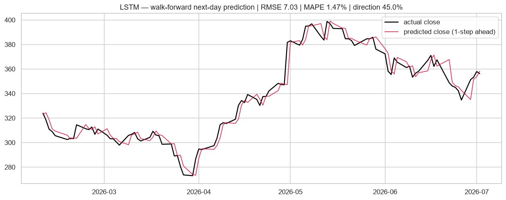
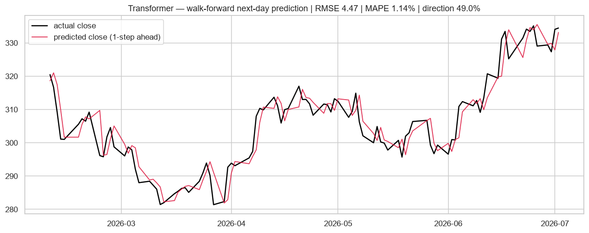
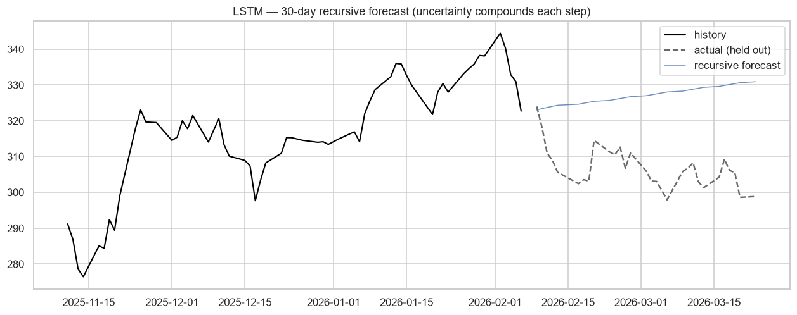
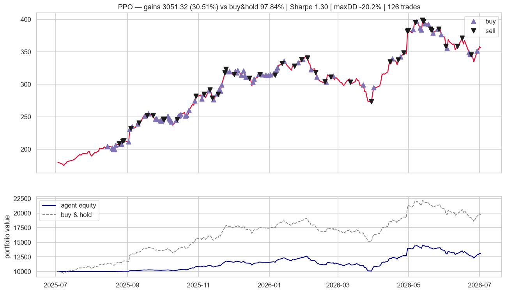
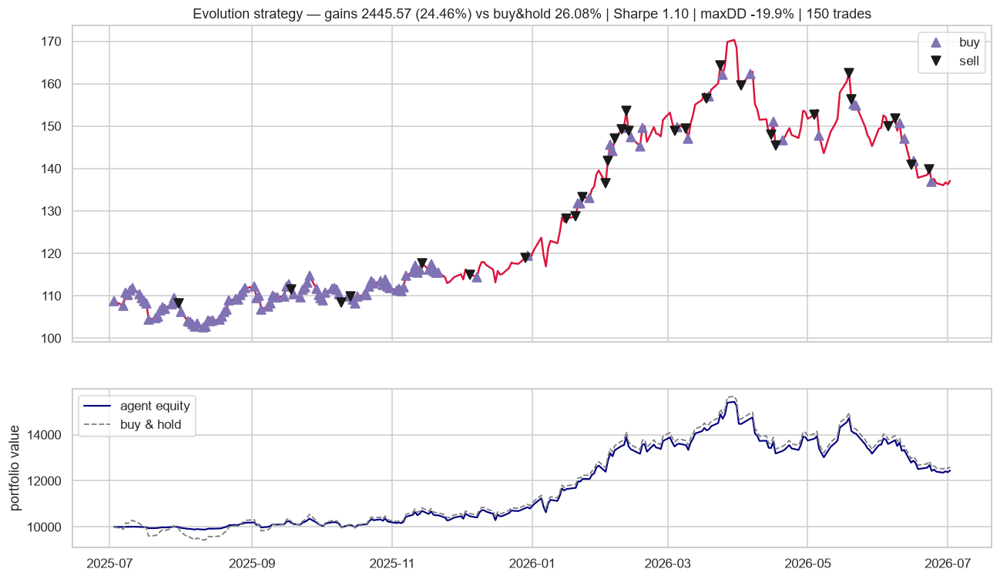
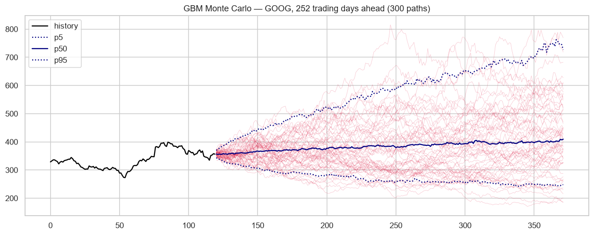
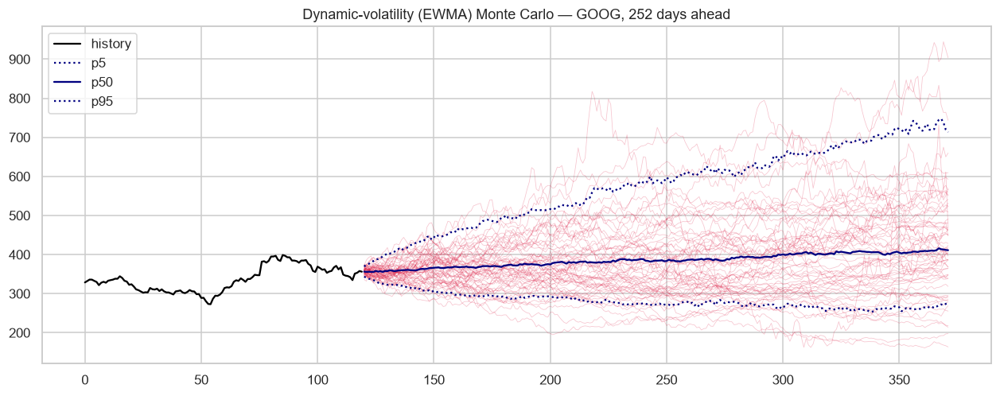
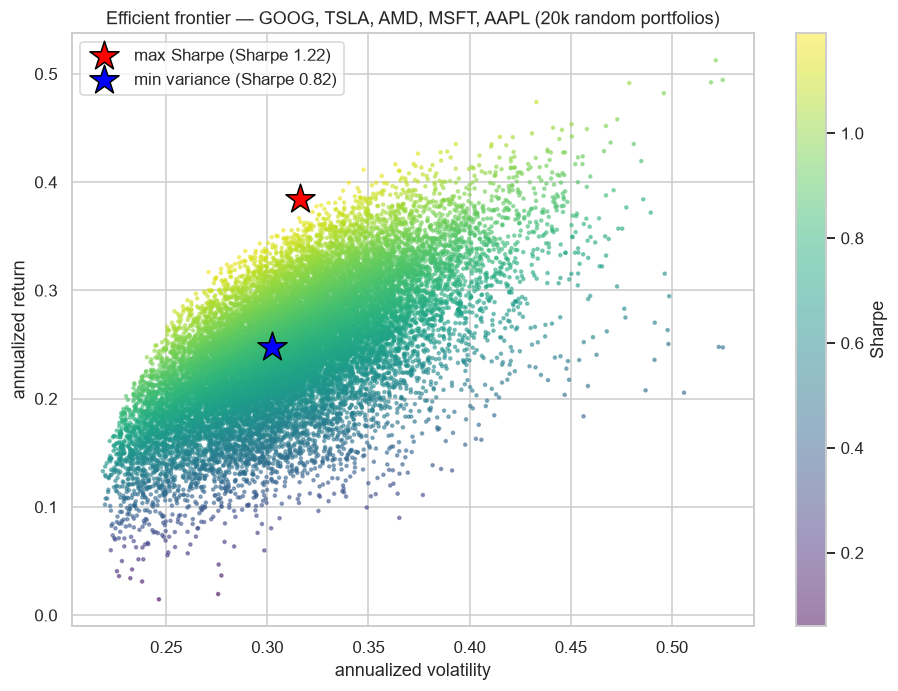
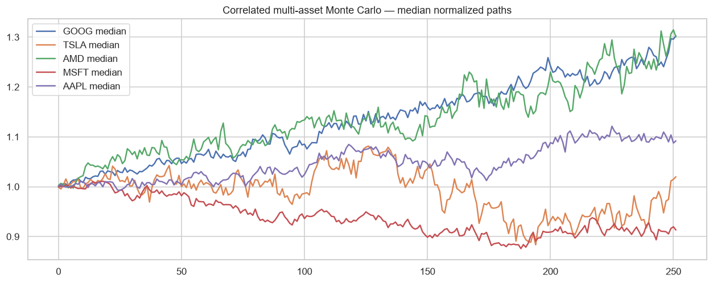

# MarketPulse 📈

**Modern stock forecasting, trading agents & market simulations** — a 2026 reimagining of the classic
[huseinzol05/Stock-Prediction-Models](https://github.com/huseinzol05/Stock-Prediction-Models)
(archived, TensorFlow 1.x), rebuilt from scratch on today's stack:

- **PyTorch** forecasters — LSTM, GRU, Transformer, **N-BEATS**, **PatchTST** — plus ARIMA, XGBoost and a drift baseline
- **Reinforcement-learning trading agents** — DQN & PPO via stable-baselines3 on a custom **Gymnasium** environment, plus an evolution-strategy agent and rule-based baselines
- **Monte Carlo simulations** — GBM, EWMA dynamic volatility, correlated multi-asset — and efficient-frontier portfolio optimization
- **Live data** via yfinance (locally cached), with bundled CSVs as offline fallback

What makes it different from the original (and from most "stock prediction" repos): **honest evaluation**.

- Forecasters predict **next-day log returns**, scored one-step-ahead **walk-forward** — no recursive
  error hiding, no smoothing tricks that inflate "accuracy" to 95%.
- Every RMSE ships with a **bootstrap 95% CI**, and every model is tested against the drift baseline
  with a **Diebold-Mariano test** (HLN small-sample correction) — so "model X wins" claims carry p-values.
- Results are reported on **three tickers from different sectors** (GOOG · JPM · XOM), not one
  cherry-picked chart.
- Trading agents train on the **first 80%** of history and are backtested **out-of-sample on the last
  20%**, with 10 bps transaction costs per side.
- A **22-test pytest suite** guards against leakage and broken cost accounting.

---

## Quickstart

```bash
python -m venv .venv
.venv\Scripts\pip install -r requirements.txt   # Windows

# everything: forecasting zoo + agents + simulations (charts land in output/)
python scripts/run_all.py GOOG

# or individually
python scripts/run_forecasting.py JPM
python scripts/run_agents.py XOM
python scripts/run_simulations.py

# quick one-off forecast
python scripts/forecast.py TSLA patchtst 30
```

Smoke-run env vars: `EPOCHS`, `TEST_SIZE` (forecasting) · `ES_ITER`, `RL_STEPS` (agents).

---

## Results — forecasting (5y daily, last 100 days walk-forward, one-step-ahead)

**RMSE is shown with a bootstrap 95% CI; `DM p` is the Diebold-Mariano p-value versus the drift
baseline (squared-error loss).** Sorted by RMSE.

**GOOG (tech)**

| model | RMSE ($) [95% CI] | MAPE | direction | DM p vs drift |
|---|---|---|---|---|
| ARIMA | 7.03 [5.43, 8.79] | 1.46% | 45% | 0.81 |
| LSTM | 7.03 [5.44, 8.79] | 1.47% | 45% | 0.84 |
| GRU | 7.08 [5.51, 8.82] | 1.50% | 37% | 0.98 |
| Drift (baseline) | 7.08 [5.65, 8.67] | 1.53% | 53% | — |
| Transformer | 7.11 [5.57, 8.81] | 1.51% | 47% | 0.90 |
| PatchTST | 7.48 [6.09, 9.03] | 1.69% | 40% | 0.21 |
| XGBoost | 7.51 [5.90, 9.32] | 1.62% | 45% | 0.74 |
| N-BEATS | 7.76 [6.16, 9.53] | 1.71% | 41% | 0.08 |

**JPM (financials)**

| model | RMSE ($) [95% CI] | MAPE | direction | DM p vs drift |
|---|---|---|---|---|
| LSTM | 4.44 [3.72, 5.11] | 1.11% | 52% | 0.36 |
| GRU | 4.45 [3.73, 5.13] | 1.11% | 52% | 0.41 |
| ARIMA | 4.45 [3.75, 5.13] | 1.11% | 52% | 0.43 |
| Transformer | 4.47 [3.78, 5.14] | 1.14% | 49% | 0.72 |
| Drift (baseline) | 4.51 [3.78, 5.19] | 1.15% | 55% | — |
| N-BEATS | 4.65 [3.94, 5.34] | 1.17% | 44% | 0.15 |
| XGBoost | 4.82 [4.10, 5.52] | 1.21% | 52% | 0.57 |
| PatchTST | 4.91 [4.24, 5.58] | 1.27% | 48% | **0.01** (worse) |

**XOM (energy)**

| model | RMSE ($) [95% CI] | MAPE | direction | DM p vs drift |
|---|---|---|---|---|
| ARIMA | 2.80 [2.36, 3.29] | 1.41% | 60% | 0.20 |
| LSTM | 2.81 [2.36, 3.31] | 1.41% | 53% | 0.18 |
| GRU | 2.81 [2.37, 3.31] | 1.41% | 59% | 0.28 |
| Transformer | 2.85 [2.39, 3.36] | 1.41% | 52% | 0.62 |
| N-BEATS | 2.88 [2.42, 3.39] | 1.43% | 53% | 0.92 |
| Drift (baseline) | 2.89 [2.42, 3.39] | 1.46% | 51% | — |
| XGBoost | 2.92 [2.45, 3.38] | 1.51% | 53% | 0.93 |
| PatchTST | 3.11 [2.56, 3.69] | 1.52% | 56% | 0.07 (worse) |

**The honest takeaway** (and the reason these tables look nothing like the original repo's 95%
claims): across 3 tickers × 7 models, **not one model beats the drift baseline at p < 0.05** — every
RMSE confidence interval overlaps, and the single significant DM result is PatchTST doing significantly
*worse* on JPM. On daily data, next-day returns are close to unpredictable; directional accuracy
hovers around a coin flip. That *is* the expected result for an efficient market — any repo telling
you otherwise is leaking the future into its metrics.




30-day recursive forecasts (uncertainty compounds — labeled as scenarios, not predictions):



---

## Results — trading agents (out-of-sample last 20% ≈ 1 year, 10 bps fees per side)

> **Read before comparing to buy & hold:** agents trade **one unit per transaction** on a $10k
> account (the original repo's convention, kept so every agent is comparable), so they are never
> fully invested — their ROI is structurally capped versus buy & hold in a bull market. The fair
> comparisons are agent vs. agent, and Sharpe / drawdown rather than raw ROI.

ROI (%) by ticker, with buy & hold for scale:

| agent | GOOG | JPM | XOM | profitable on |
|---|---|---|---|---|
| Evolution strategy | **+18.8** | **+11.6** | **+24.5** | **3 / 3** |
| PPO (RL) | **+30.5** | +11.3 | +3.4 | 3 / 3 |
| DQN (RL) | +0.3 | +5.4 | −0.2 | 2 / 3 |
| RSI mean-reversion | +3.8 | +3.6 | −0.4 | 2 / 3 |
| Turtle breakout | +25.4 | −1.9 | +0.1 | 2 / 3 |
| SMA crossover | +1.5 | +0.3 | −0.2 | 2 / 3 |
| *Buy & hold* | *+97.8* | *+14.6* | *+26.1* | — |

Risk-adjusted detail (Sharpe / max drawdown): see `output/agent_results_{goog,jpm,xom}.csv` —
e.g. on GOOG the evolution-strategy agent made 18.8% with only a −7.4% max drawdown.

Reading it honestly:

- **Multi-ticker reporting is the point** — turtle breakout looks brilliant on GOOG (+25.4%) and
  *loses money* on JPM. A single-ticker table would have been cherry-picking.
- The **evolution-strategy agent is the only one consistently profitable and near buy & hold**
  on JPM and XOM; the RL agents (PPO especially) are strong but less stable across regimes.
- Because of the one-unit sizing noted above, GOOG's +97.8% buy & hold year is unreachable by
  design — the gap is a property of the position-sizing convention, not evidence the agents
  failed to learn.

> ⚠️ A Sharpe ratio computed from ~20 trades (SMA crossover) is not statistically reliable — it is
> shown for completeness, not as a recommendation. Treat any single-year, single-ticker backtest
> metric as an estimate with wide error bars.





---

## Results — simulations

Monte Carlo, 252 trading days ahead (300 paths, p5/p50/p95 bands):




Efficient frontier over GOOG / TSLA / AMD / MSFT / AAPL (20k random portfolios + SLSQP optimum) —
a 5-asset universe chosen to give the portfolio-optimization demo enough correlated-but-distinct
assets to produce a meaningful frontier; it is independent of the 3-ticker evaluation above.
Current max-Sharpe weights: **GOOG 68% · AMD 26% · AAPL 6%**:




---

## Project structure

```
marketpulse/
  data.py                 yfinance loader + cache + technical features
  evaluation.py           walk-forward metrics & charts
  stats.py                Diebold-Mariano test (HLN-corrected) + bootstrap CIs
  forecasting/
    base.py               Forecaster interface + walk-forward driver
    baselines.py          Drift, ARIMA
    xgb.py                XGBoost on engineered features
    torch_models.py       LSTM, GRU, Transformer (shared trainer, early stopping)
    nbeats.py             N-BEATS (Oreshkin et al. 2020)
    patchtst.py           PatchTST (Nie et al. 2023)
  agents/
    env.py                Gymnasium trading environment
    backtest.py           cost-aware backtester + signal/equity charts
    rules.py              turtle, SMA crossover, RSI
    evolution.py          evolution-strategy agent
    rl.py                 DQN / PPO (stable-baselines3)
  simulation/
    monte_carlo.py        GBM, EWMA dynamic vol, correlated multi-asset
    portfolio.py          efficient frontier (random search + SLSQP)
scripts/
  run_all.py · run_forecasting.py · run_agents.py · run_simulations.py · forecast.py
tests/
  test_no_leakage.py · test_backtest.py · test_stats.py
```

## Tests

```bash
.venv\Scripts\python -m pytest tests/ -q
```

22 tests guard the two places a quant project silently lies to you:

- **No leakage** (`tests/test_no_leakage.py`) — chronological splits are disjoint; `walk_forward`
  never fits on test days; poisoning a future value leaves earlier predictions bit-identical
  (checked for both the drift baseline and the LSTM); window/target alignment; feature targets
  are strictly next-day.
- **Cost accounting** (`tests/test_backtest.py`) — exact cash arithmetic with fees on a
  buy/sell round-trip; no selling from empty inventory, no buying without cash;
  mark-to-market equity; the Gymnasium env charges the same fees and pays log-value rewards.
- **Statistics** (`tests/test_stats.py`) — the DM test is symmetric, flags a clearly better
  model, and returns p≈1 for identical errors; bootstrap CIs contain the point estimate and
  narrow as errors shrink.

## Credits & disclaimer

Inspired by [huseinzol05/Stock-Prediction-Models](https://github.com/huseinzol05/Stock-Prediction-Models)
(Apache-2.0) — the model-zoo spirit and the buy/sell chart style live on; every line here is a new
implementation. **This is a research/portfolio project, not financial advice.** Past performance of
any model or agent here says nothing about future returns.
